WPS-GUI
=======

The WPS-GUI allows for the creating of graphical process workflows that can be easily executed and reproduced. Processes that are available in workflows are provided by the standard set of processes available in a default GeoServer installation.

Application panels
------------------

The WPS-GUI consists of three panels, from left to right:

* Process List
* Canvas
* I/O (Input/Output)

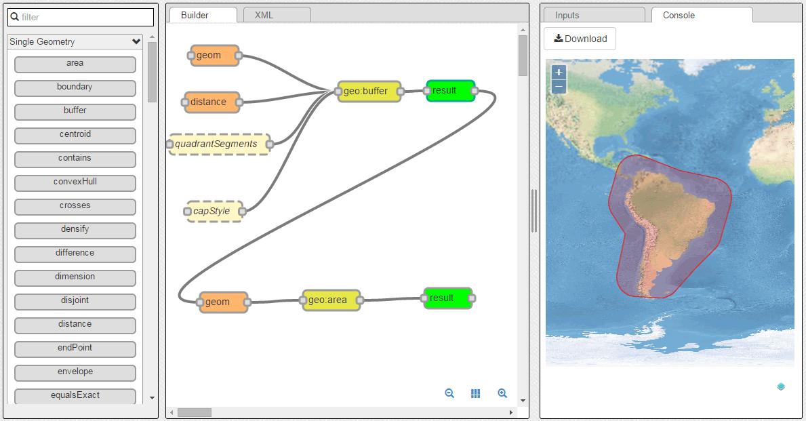

   WPS-GUI application

The Process List panel contains a list of available processes that can be added to a workflow. They are divided into three categories: Single Geometry, Raster, and Vector Feature Collection. The difference between these categories is the type of input geometry they operate on. The list of processes are actually blocks that can be dragged onto the Canvas.

The Canvas panel is where the workflow is designed. Processes are dragged from the Process List and placed on the canvas, accompanied by their respecitve inputs. These inputs can be specified in the Input/Output panel, or connected to other processes to create a chain. Also available is an :guilabel:`XML` tab where the underlying request to GeoServer can be found.

The I/O panel is where inputs to processes can be specified, and where the result of a workflow is displayed.

Toolbar
-------

There is also a toolbar at the top of the application. This contains one menu and three buttons.

   Toolbar

* The :guilabel:`File` menu allows for the current state of the workflow to be saved and retrieved. The workflow can either saved to the local browser cache or to the clipboard, where the code to reproduce the workflow can be copied to a file. The menu also has options for loading data from the browser cache and from the clipboard.

  .. figure:: img/filemenu.png

     File menu

  .. figure:: img/export.png

     Exporting to clipboard

* The :guilabel:`Clear` button will remove all contents of the Canvas.

  .. warning:: This operation is not undoable.

* The :guilabel:`Help` button brings up this content.
* The :guilabel:`Run Process` button will execute the currently selected process or chain of processes in the Canvas. 

Usage
-----

Using the WPS-GUI involves the following steps:

* Adding the processes to the workflow
* Setting the inputs for the processes
* Running the workflow

Adding a process to the workflow
~~~~~~~~~~~~~~~~~~~~~~~~~~~~~~~~

To add a process to a workflow, select it from the Process List and drag it onto the Canvas. The process block will be added in the location where it is dropped. Attached to it will be one or more input blocks, representing each of the inputs used to run the process. Also attached is a green block, often called :guilabel:`result`, for the output of the process. The block is only used when chaining to another process.

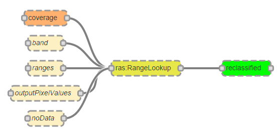

   The ``ras:RangeLookup`` process added to the Canvas
 
To remove a process from the workflow, click the central yellow block to select it and press the :kbd:`Backspace` or :kbd:`Delete` key. You can also click the :guilabel:`Clear` button at the top of the screen to remove all processes from the Canvas.

Setting the inputs
~~~~~~~~~~~~~~~~~~

Inputs used by a process are rendered in the canvas in two colors: light brown for those input parameters that are optional, and a darker brown for those that are required.

.. figure:: img/param_colors.png

   A required input and an optional input

If the parameter has correctly been assigned a value, the block will have a **solid border**. 

.. figure:: img/solid_line.png

   A valid input

If the parameter hasn't been assigned a value, or if that value is invalid, the block will have a **dashed border**.

.. figure:: img/dashed_line.png

   An invalid/unset input

All of the required inputs must be assigned a valid value (and have a solid border) before being able to run a workflow.

There are two ways of setting a value for a given parameters:

* Selecting/entering the value directly in the :guilabel:`Inputs` tab
* Linking the input to the output of another process

To set the value for a parameter using a specified value, click the parameter name. In the I/O panel with the :guilabel:`Input` tab selected, you will see an element corresponding to the parameter where the value can be entered or selected. The type of the element depends on the type of parameter. For instance, for a string or numeric input you will have a textbox:

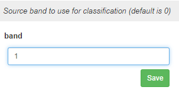

   Input textbox

For a vector or raster input layer, there will be a box where a layer can be selected from layers available in GeoServer.

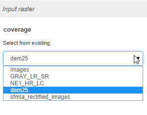

   Input layer select

When the input is a geometry, this can be generated by drawing a geometry in the map (:guilabel:`via Map`):

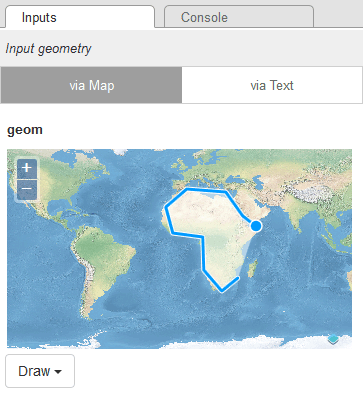

   Map input

Or a geometry can be input via a text box, in either Well-Known Text (WKT) or GML (:guilabel:`via Text`).

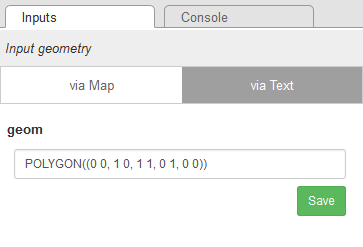

   WKT input 

Once you have entered or selected a value, click the :guilabel:`Save` button. Some parameter types need to be validated, and this validation will be shown here.

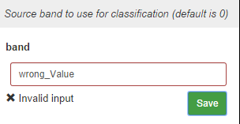

   Invalid input

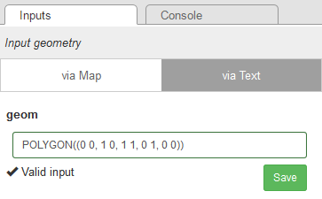

   Valid input

Certain parameters allow multiple values to be used. In this case, you will see a button named :guilabel:`+1 [parameter_name]`.

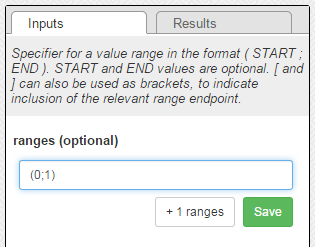

   A parameter that can accept more than one value

Clicking this button will cause a new item to be added in the canvas as a parameter. Click the button as many times as you need for entering your configuration, and then set the values of each of the new parameters individually.

.. figure:: img/add_params.png

   One additional "ranges" parameter added to the process

To link the input to the output of another process, make sure two processes are in the Canvas. Click the plug on the side of the green output block for one of the processes, and drag a wire to one of the inputs of the other process. If the connection is valid, the plug will be highlighted.

.. figure:: img/chain.png

   Chaining two processes

To remove a connection, click the wire so that it is highlighted, and then press the :kbd:`Backspace` or :kbd:`Delete` key.

Running a workflow
------------------

A workflow can consist of one or more processes with appropriate inputs.

When a workflow contains a single process, click any block to select it, and then click :guilabel:`Run Process`. To run a chain of processes, click a block associated with the **final process in the chain**, and then click :guilabel:`Run Process`.

.. note:: Every process can be run as its own workflow, even when an intermediate step in a chain. The process for running an intermediate process workflow is the same, in which case all process that come "after" the selected process will be ignored.

In all cases, a single request is sent to GeoServer, with chained processes encoded as nested inputs.

Results are either shown on the :guilabel:`Console` tab of the I/O panel or, depending on the output format, downloaded.

For vector layers, results will be shown on a map if the coordinate reference system of the layer is either EPSG:4326 (Mercator) or EPSG:3857 (Web Mercator). 

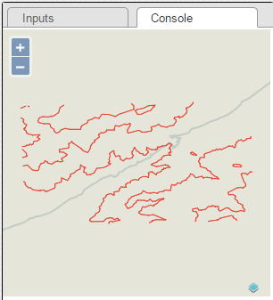

   Output in map

Otherwise, the resulting layer will be output as GML.

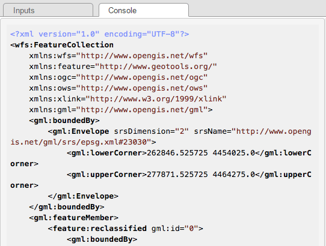

   GML output

For raster outputs the result will always be downloaded, typically as a TIFF file.
