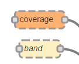
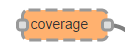
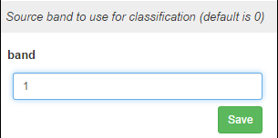
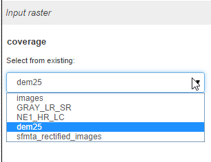
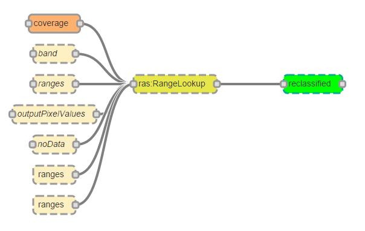
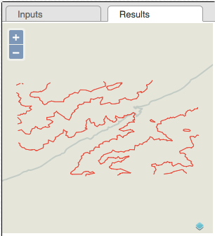
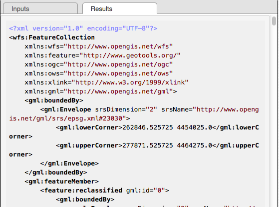

Usage
######

The WPS-GUI allows to create workflows that can later be easily executed and reproduced. Processes available to define a workflow are provided by the standard set of processes available in a default GeoServer installation.

Using the WPS-GUI involves the following steps:

- Adding the processes that are to be included in the workflow
- Setting the inputs for the processes. Those inputs might come from other processes, establishing a link between them and creating a chain of processes.
- Running  a process to obtain its output.

These steps are discussed in detail in the following sections.

Adding a process to the workflow
**********************************

To add a process to a workflow, select it from the list in the left-hand side of the window, and drag it onto the canvas. The process will be added in the location where you drop it, and it will contain one central element representing the process itself, along with individual elements representing each of the inputs it requires and the outputs it produces.

.. figure:: process. png

To remove a process from the workflow, click on it to selected it (on the central yellow element that represents the process, not any of the elements representing inputs or outputs) and press the backspace key. The process will be removed from the canvas. You can also use the Clear button to remove all processes on the canvas.

Setting the inputs
*******************

Inputs used by a process are rendered in the canvas in two colors: light brown for those input parameters that are not mandatory, and a darker brown for those that are mandatory. 

If the parameter has already been assigned a value, the box representing it will have a normal border line. 

.. figure:: normal_line.png

If the parameter hasn't been assigned a value yet, it will be rendered with a dashed border line.

Before being able to run an algorithm, all of its mandatory inputs must be assigned a valid value.

There are two ways of setting a value for a given parameters:

- selecting/entering the value directly in the *Inputs* tab.
- linking the input to the output of a previous process.

Setting an input using the Inputs tab
--------------------------------------

To set the value for a parameter using a value not produced by another algorithm, just click on the parameter name. In the right-hand side of the window, in the *Inputs* tab, you will see an element corresponding to the parameter where the value can be entered or selected. The type of the element depends on the type of parameter. For instance, for a string or numeric input you will have a textbox, 

while for the case of a raster layer, you will have a dropdown box where you can select from the list of the raster layers available in the GeoServer instance.

Once you have entered or selected the value that you want to use for the parameter, click on the *Save* button. That will store the value in the parameter. For some parameter types, some validation routines are run before storing the value. If the value is not correct and does not validate, you will see a label indicating it.

.. figure:: invalid_value.png

Certain parameters allow multiple values to be used (the parameter has a ``maxOccurs`` parameter larger than 1). In that case, you will see a button named *+1 [parameter_name]*. Clicking on it will cause a new item to be added in the canvas as a parameter. 

In the image above, notice how 2 additional "levels" parameters have been added to Barnes Surface process, which originally contains just one of them

Click on the button as many times as you need for entering your configuration, and then set the values of each of the new parameters individually. The WPS-GUI will then gather all the values with the same parameter name and build a multiple value to be passed to the process.

Running a process
******************

Any of the processes that are included in a workflow can be executed and its output obtained. To do so, select the process central element in the canvas and then click on the *Run Process* button in the upper part of the window.

If the process depends on other processes (that is, it uses the output of another process as input), the processes it depends on will get nested in the XML request, so a single request is sent to GeoServer. This means the intermediate outputs are not available automatically, and would require running that subprocess individually.

In the most typical case, you will be creating a linear model with chained processes, and then you will run the last one of them, so you get the output and execute all the previous processes in the chain before obtaining the final result.

Results are shown on the *Results* tab on the right-hand side of the window, or downloaded, depending on the characteristics of the output data itself.

For vector layers, results will be shown in a map if the CRS of the layer is either EPSG:4326 or EPSG:3857, the two CRSs natively supported. 

Otherwise, the resulting layer will be printed as GML in a textbox

For raster outputs the result will always be downloaded, normally as a TIFF file.
